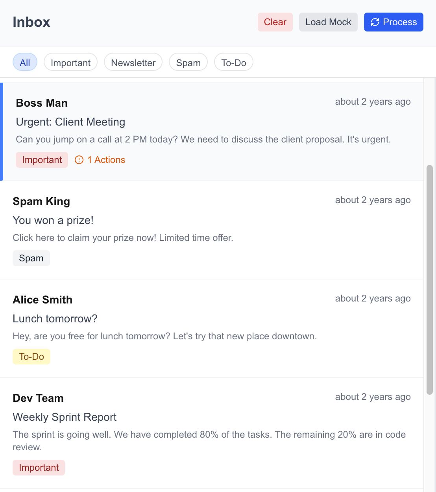
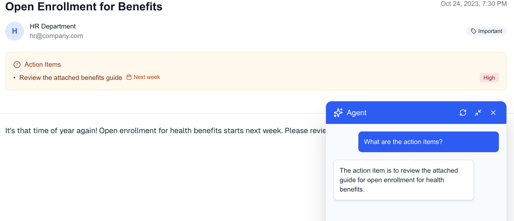
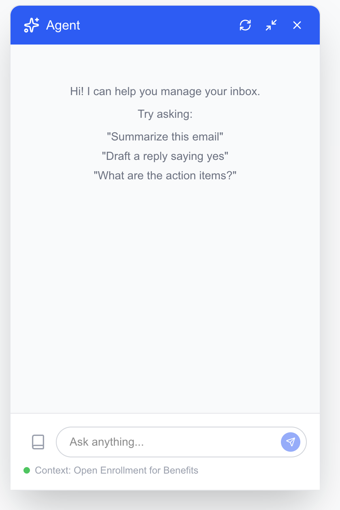
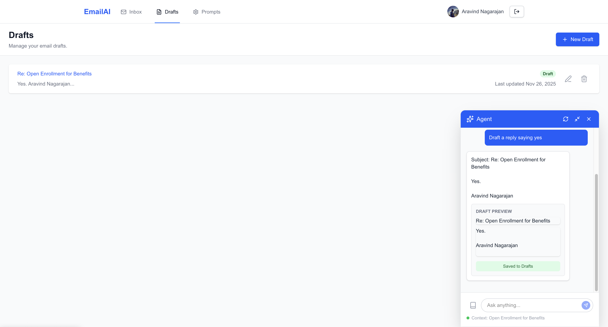
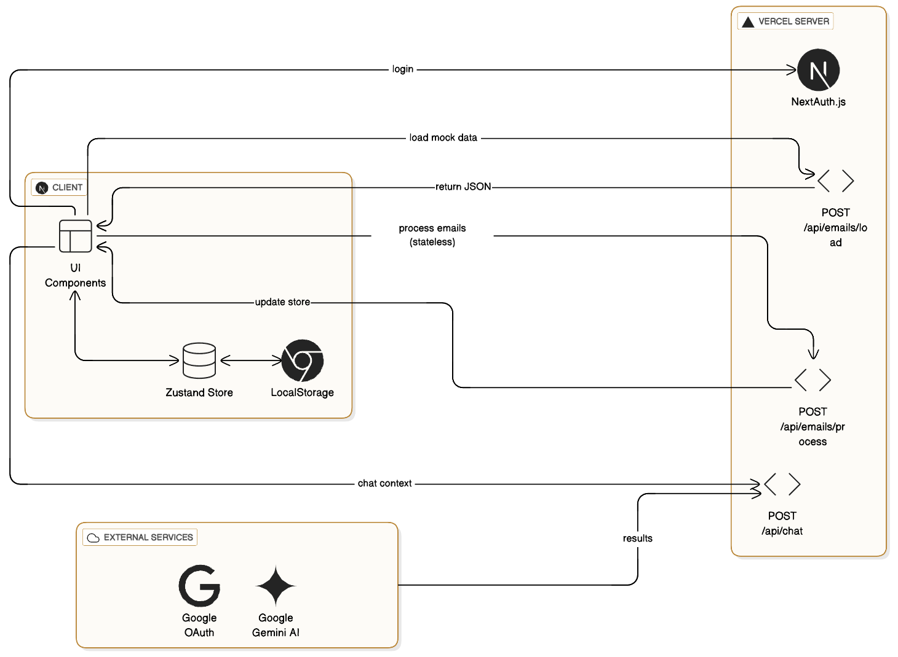

# Intelligent Email Productivity Agent

Ocean-Email is a prompt-driven AI email assistant designed to revolutionize how you interact with your inbox. Built with Next.js and Google's Gemini AI, it transforms your email experience by automatically categorizing messages, extracting action items, and drafting replies based on your custom instructions.

## 🚀 Features

- **🧠 Prompt-Driven Intelligence**: The core behavior of the agent (categorization, drafting, extraction) is controlled by user-editable prompts. You can tweak the "brain" of the agent without changing code.

- **📂 Smart Inbox**: Automatically categorizes emails into **Important**, **Newsletter**, **Spam**, and **To-Do**.

- **✅ Action Item Extraction**: Parses emails to identify tasks, deadlines, and priorities, presenting them in a structured format.

- **💬 AI Chat Companion**: A context-aware chat interface that lives alongside your email. Ask it to "Summarize this", "Draft a reply", or "Find action items".
- 
**📝 Draft Management**: Generates drafts based on your instructions. Drafts are saved for review and can be edited directly in the chat or the dedicated Drafts page.

- **🛡️ Privacy-First**: Drafts are never sent automatically. All AI actions are user-initiated or reviewable.
- **🔌 Modular Architecture**: Built with a Repository pattern to easily swap the mock data backend for real Gmail/Outlook integration.

## 🛠️ Tech Stack

- **Framework**: [Next.js 14](https://nextjs.org/) (App Router)
- **Language**: [TypeScript](https://www.typescriptlang.org/)
- **AI Model**: [Google Gemini Pro](https://ai.google.dev/) (via `@google/generative-ai`)
- **Styling**: [Tailwind CSS](https://tailwindcss.com/)
- **Auth**: [NextAuth.js](https://next-auth.js.org/)
- **State Management**: [Zustand](https://github.com/pmndrs/zustand)
- **Icons**: [Lucide React](https://lucide.dev/)

## 🏁 Getting Started

### Prerequisites

- Node.js 18+
- A Google Cloud Project with OAuth credentials (for NextAuth)
- A Google AI Studio API Key (for Gemini)

### Installation

1.  **Clone the repository**:
    ```bash
    git clone https://github.com/AravindXD/ocean-email.git
    cd ocean-email
    ```

2.  **Install dependencies**:
    ```bash
    npm install
    ```

3.  **Configure Environment Variables**:
    Create a `.env.local` file in the root directory:
    ```env
    # Authentication (Google OAuth)
    GOOGLE_CLIENT_ID=your_google_client_id
    GOOGLE_CLIENT_SECRET=your_google_client_secret
    NEXTAUTH_SECRET=your_nextauth_secret
    NEXTAUTH_URL=http://localhost:3000

    # AI (Gemini)
    GEMINI_API_KEY=your_gemini_api_key
    ```

4.  **Run the Development Server**:
    ```bash
    npm run dev
    ```

5.  **Open the App**:
    Navigate to [http://localhost:3000](http://localhost:3000).

## 📂 Project Structure

```
src/
├── app/                 # Next.js App Router pages and API routes
│   ├── (dashboard)/     # Protected routes (Inbox, Drafts, Prompts)
│   └── api/             # Backend API endpoints
├── components/          # Reusable UI components
│   ├── ChatInterface.tsx # The core AI chat component
│   └── ...
├── lib/                 # Utilities and business logic
│   ├── gemini.ts        # AI integration logic
│   ├── db.ts            # Database singleton
│   └── repos/           # Data access layer (Repository Pattern)
├── types/               # TypeScript definitions
└── ...
data/                    # Local JSON storage for mock data
```

## 🏗️ Architecture & Data Layer



Ocean-Email uses a **Repository Pattern** to abstract data access. This ensures that the application logic (UI, AI processing) is decoupled from *how* data is stored.

- **Interfaces** (`src/lib/repos/types.ts`): Define the contract for data access (e.g., `IEmailRepository`).
- **Implementations** (`src/lib/repos/json.ts`): Current implementation uses the local file system (`data/`) to store emails, prompts, and drafts as JSON files.
- **Database** (`src/lib/db.ts`): A singleton that exposes the repositories.

## 🔄 Migrating to Real Email (Gmail)

The application is designed to be "backend-agnostic". Switching from the Mock Inbox to real Gmail involves three main steps:

### 1. Update Authentication Scopes
Modify `src/lib/auth.ts` to request permission to read and send emails.
```typescript
// src/lib/auth.ts
GoogleProvider({
  clientId: process.env.GOOGLE_CLIENT_ID!,
  clientSecret: process.env.GOOGLE_CLIENT_SECRET!,
  authorization: {
    params: {
      scope: "openid email profile https://www.googleapis.com/auth/gmail.readonly https://www.googleapis.com/auth/gmail.compose"
    }
  }
})
```

### 2. Implement Gmail Repository
Create a new file `src/lib/repos/gmail.ts` that implements `IEmailRepository`.
```typescript
// src/lib/repos/gmail.ts
import { google } from 'googleapis';
import { IEmailRepository } from './types';

export class GmailRepository implements IEmailRepository {
  async getUserEmails(userId: string) {
    // Use google.gmail('v1').users.messages.list()
    // Fetch and map Gmail messages to our Email type
  }
  // Implement other methods (saveEmail, deleteEmail, etc.)
}
```

### 3. Switch the Database
Update `src/lib/db.ts` to use the new repository.
```typescript
// src/lib/db.ts
import { GmailRepository } from "./repos/gmail";

class Database {
  // ...
  private constructor() {
    // Switch from JsonEmailRepository to GmailRepository
    this.emails = new GmailRepository(); 
    this.prompts = new JsonPromptRepository(); // Keep prompts local or move to DB
    this.drafts = new JsonDraftRepository();
  }
}
```

## 🔮 Future Enhancements

- **Real-time Sync**: Implement webhooks (Gmail Push Notifications) to update the inbox instantly.
- **RAG (Retrieval-Augmented Generation)**: Index past emails to allow the agent to answer questions like "What did Sarah say about the budget last month?".
- **Multi-Provider Support**: Add Outlook/Office365 support by implementing an `OutlookRepository`.
- **Voice Interface**: Add speech-to-text for dictating replies.
- **Mobile App**: Build a React Native version reusing the same API and logic.
